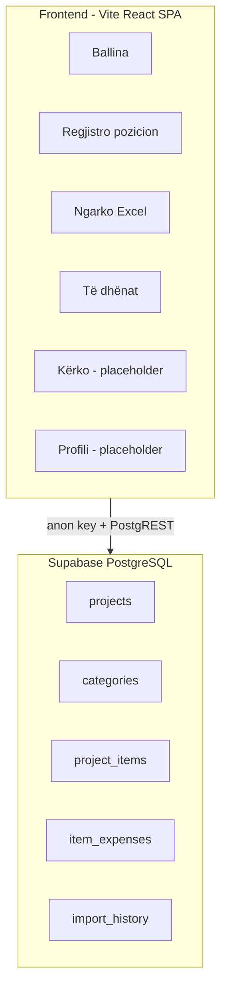

# Review i projektit Graniti Web

## Çka është dhe çka bën sistemi

**Graniti Web** (`graniti-web`) është një **panel administrativ web** për kompaninë/ekipin e ndërtimit që menaxhon **paramasa dhe oferta** (vlerësime kostoje të projekteve).

| Funksion                     | Përshkrim                                                                                                                                                                                                        |
| ---------------------------- | ---------------------------------------------------------------------------------------------------------------------------------------------------------------------------------------------------------------- |
| **Ballina** (`/`)            | Statistika: numër projektesh, kategorish, pozicionesh; status lidhjeje me Supabase                                                                                                                               |
| **Regjistro** (`/register`)  | Shtim manual pozicioni: projekt/kategori (ekzistues ose i ri), kostot (material, punë, ditë, ushqim, transport sipas qytetit të Kosovës, tjera), fitim %, TVSH 18%; ruajtje në `project_items` + `item_expenses` |
| **Ngarko Excel** (`/import`) | Lexon `.xlsx`/`.xls` me detektim kolonash shqip (`[src/lib/excel.ts](src/lib/excel.ts)`); preview; insert masiv; **undo 10 sek** përmes `import_history`                                                         |
| **Të dhënat** (`/data`)      | Listë projektesh/kategorish, detaje pozicionesh, edit inline sasi/çmim, export CSV, vlerë totale sistemi                                                                                                         |
| **Kërko** (`/search`)        | Vetëm UI — **nuk kërkon në DB**                                                                                                                                                                                  |
| **Profili** (`/profile`)     | Tekst placeholder                                                                                                                                                                                                |

**Stack:** React 18, TypeScript, Vite 6, React Router 6, react-hook-form, xlsx, lucide-react, Supabase JS. **Nuk ka backend të veçantë** — gjithë logjika është në `[App.tsx](App.tsx)` (~807 rreshta).

**Dokumentim:** vetëm `[database-schema.sql](database-schema.sql)` (shqip). **Nuk ka README**, `.gitignore`, `.env.example`, teste, ose konfigurim ESLint (edhe pse `npm run lint` ekziston në `[package.json](package.json)`).

---

## Çka funksionon mirë (pikat e forta)

- **Domain i qartë:** paramasa/oferta ndërtimi me kategori, pozicione, shpenzime të detajuara — i përshtatshëm për temë semestri.
- **Import Excel i zgjuar:** normalizim shqip (thekse), detektim header-i, fallback parser — `[src/lib/excel.ts](src/lib/excel.ts)`.
- **Regjistrim manual i plotë:** kalkulim çmimi me transport lokacion (Ferizaj, Prishtinë, etj.), TVSH, fitim.
- **Undo import:** audit trail në `import_history` + rollback — feature e mirë për UX.
- **UI e konsistente në shqip** me CSS custom (Space Grotesk, variabla ngjyrash).
- **Schema SQL e menduar:** CASCADE, RLS i aktivizuar, tabela për historik importi.
- **Build i pastër:** `tsc` + `vite build` — output në `dist/`.

---

## Çka mungon (gaps)

| Zona                                    | Detaje                                                                                        |
| --------------------------------------- | --------------------------------------------------------------------------------------------- |
| **Autentifikim**                        | Asnjë `supabase.auth`; paneli “Admin” është i hapur për këdo me anon key                      |
| **README / setup**                      | Mungon udhëzim instalimi (`npm install`, `.env`, ekzekutim `database-schema.sql` në Supabase) |
| **Repo hygiene**                        | Pa `.gitignore` → rrezik commit-i i `[.env](.env)` me `VITE_SUPABASE_*`                       |
| **ESLint**                              | Script `lint` pa config — nuk funksionon si duhet                                             |
| **Teste**                               | Zero unit/integration/E2E                                                                     |
| **Supabase migrations**                 | Vetëm një skedar SQL manual; pa versionim migrimesh                                           |
| **Tipizim DB**                          | `any` kudo në `App.tsx`; `[src/types.ts](src/types.ts)` i papërdorur                          |
| **Komponentë**                          | Gjithçka në një file — pa `components/`, hooks, services                                      |
| **Grafikë**                             | `victory` në deps por i papërdorur; CSS për grafikë ekziston por pa komponent                 |
| **Search global**                       | Faqja `/search` bosh                                                                          |
| **Profil / settings**                   | Faqja `/profile` bosh                                                                         |
| **Fusha schema të papërdorura**         | `projects.client`, `status`, `total_amount`, `description` — app insert-on vetëm `{ name }`   |
| **Referencë projektesh të përfunduara** | Schema komenton “projekte të përfunduara si referencë” — nuk ka UI për këtë                   |

---

## Çka nuk është mirë (probleme konkrete)

### 1. Siguria (kritike për prodhim / demo publike)

- RLS në `[database-schema.sql](database-schema.sql)` është `USING (true) WITH CHECK (true)` — **të dhënat janë të lexueshme/shkrueshme nga çdo klient me anon key**.
- Komenti thotë “përdorues të loguar”, por **nuk ka auth**.
- Çelësi anon bundle-ohet në frontend (normale për Supabase) — mbrojtja duhet të jetë RLS + Auth, jo fshehja e key-it.

### 2. Bug-e dhe drift schema

- `**expense_type`:** SQL lejon `material|labor|machinery|other`; app përdor edhe `food` dhe `transport` (`[App.tsx](App.tsx)` rreshta 266–267) — pa CHECK constraint në DB mund të jetë OK, por dokumentimi është i papërputhur.
- **Insights në Data page:** `projectSummaries` / `categorySummaries` filtrojnë nga `projectItems` / `categoryItems` që ngarkohen **vetëm për projektin/kategorinë e zgjedhur** — listat “Top 5” shpesh do të jenë **bosh** ose të pasakta (`[App.tsx](App.tsx)` ~563–585).
- **Transaksione:** regjistrimi insert-on `project_items` pastaj `item_expenses` pa kontroll të plotë të error-it të dytë → rrezik të dhënash gjysmë.
- **Undo import:** fshin rreshta pa transaksion DB.

### 3. UI / CSS të prishur

| Problemi     | App                                    | CSS                                                                                                |
| ------------ | -------------------------------------- | -------------------------------------------------------------------------------------------------- |
| Layout shell | `app-shell`, `sidebar`, `main-content` | Përdor `.shell` — **klasa nuk përputhen**                                                          |
| Tema         | `dataset.theme` në `<html>`            | Variablat në `.theme-light` / `.theme-dark` **klasa** — **ndërrimi light/dark nuk aplikon stilet** |
| `index.html` | `lang="en"`                            | UI në shqip                                                                                        |

### 4. Cilësi kodi

- **God file:** `[App.tsx](App.tsx)` përmban routing, fetch, biznes, forma, export CSV.
- **Kod i vdekur:** `[src/data/mock.ts](src/data/mock.ts)`, `[src/types.ts](src/types.ts)`, deps `victory`, `date-fns`.
- **Gabime UX:** `alert()` për errors; pa loading skeleton global; pa 404 route.
- **Aksesibilitet:** lista projektesh me `
` në vend të `<button>`; pa `lang="sq"`.

### 5. Tooling

- `npm run lint` → ESLint **nuk është instaluar/configuruar** në devDependencies.
- Pa CI/CD, pa preview deployment docs.

---

## Çfarë mund të përmirësohet (prioritet)

### Prioritet i lartë (para dorëzimit / demo)

1. **Shto `.gitignore`** (`.env`, `node_modules`, `dist`) dhe `**.env.example**` pa sekrete.
2. **Shkruaj README.md** shqip: qëllimi, stack, setup Supabase, si të ngarkohet schema, `npm run dev`.
3. **Rregullo temën:** ose `document.documentElement.classList.toggle('theme-light'/'theme-dark')` ose CSS me `[data-theme="light"]`.
4. **Rregullo klasat layout:** `app-shell` → `.shell` ose shto stile për `.app-shell` / `.sidebar`.
5. **Fix insights në Data:** query agreguese të veçanta (SUM total_price GROUP BY project_id) në vend të filtrit lokal.
6. **Supabase Auth + RLS:** login email/password ose magic link; politika `auth.uid()` ose role-based.

### Prioritet mesatar

1. **Ndaj `App.tsx`:** `pages/`, `components/`, `hooks/useProjects.ts`, `services/supabase*.ts`.
2. **Përdor `src/types.ts`** + gjenero tipa Supabase (`supabase gen types`).
3. **Zëvendëso `alert()`** me toast/banner në UI.
4. **Përputh schema me app:** shto `food|transport` në koment/SQL CHECK; përdor `status`, `client` në formë projekti.
5. **Implemento `/search`:** kërkim në `project_items.description`, `position_number`, emër projekti.
6. **Shto ESLint + Prettier** ose hiq script-in `lint`.

### Prioritet i ulët / nice-to-have

1. Grafikë me Victory (shpërndarje kategorish, top projekte).
2. Eksport PDF/Excel nga app (jo vetëm CSV).
3. Mobile sidebar (hamburger).
4. Teste me Vitest + React Testing Library.
5. Supabase Edge Function për import të rëndë (nëse skalohet).

---

## Çfarë mund të shtosh (ide feature)

| Feature                         | Vlera për domain                                              |
| ------------------------------- | ------------------------------------------------------------- |
| **Krahasim ofertash**           | Dy projekte side-by-side për të njëjtin lloj pune             |
| **Bibliotekë çmimesh**          | Pozicione/kategori të ruajtura si template për oferta të reja |
| **Status projekti**             | draft → në proces → përfunduar (tashmë në schema)             |
| **Klienti + afati**             | Fushat `client`, `description` në UI                          |
| **Versionim oferte**            | Snapshot i një projekti në datë të caktuar                    |
| **Raport mujor**                | Total shpenzimesh material vs punë                            |
| **Multi-user / role**           | Admin vs lexues (vetëm shikim)                                |
| **Backup / export i gjithë DB** | JSON dump për siguri                                          |
| **Validim Excel**               | Raport rreshtash të refuzuar me arsye                         |
| **PWA offline**                 | Lexim i të dhënave të cache-ura (avancuar)                    |

---

## Vlerësim i përgjithshëm (për temë akademike)

| Kriter                      | Vlerësim | Shënim                                    |
| --------------------------- | -------- | ----------------------------------------- |
| **Qartësia e problemit**    | I mirë   | Paramasa ndërtimi — domain real           |
| **Implementimi funksional** | I mirë   | 3/6 faqe të plota + Excel + Supabase      |
| **Arkitektura**             | Mesatar  | Monolith SPA — OK për MVP, jo për prodhim |
| **Siguria**                 | I dobët  | RLS i hapur, pa auth                      |
| **Dokumentacioni**          | I dobët  | Vetëm SQL, pa README                      |
| **Cilësia e kodit**         | Mesatar  | Funksionon por duhet refactor             |
| **Plotësia e kërkesave**    | ~70%     | Search/Profile/Auth/charts mungojnë       |

**Përfundim:** Projekti **bën punën kryesore** që premtonte (regjistrim kostoje, import Excel, menaxhim të dhënash, llogaritje transport/TVSH). Për **dorëzim akademik**, mjafton të dokumentosh, të rregullosh bug-et e dukshme (tema, insights), dhe të shtosh **README + .gitignore**. Për **prodhim**, prioriteti është **Auth + RLS** dhe ndarja e kodit.

---

## Skedarët kryesorë për referencë

| Skedar                                       | Roli                      |
| -------------------------------------------- | ------------------------- |
| `[App.tsx](App.tsx)`                         | I gjithë aplikacioni      |
| `[src/lib/supabase.ts](src/lib/supabase.ts)` | Klienti Supabase          |
| `[src/lib/excel.ts](src/lib/excel.ts)`       | Parser Excel              |
| `[database-schema.sql](database-schema.sql)` | Modeli i të dhënave + RLS |
| `[src/styles.css](src/styles.css)`           | Stilet globale            |
| `[package.json](package.json)`               | Varësitë dhe scriptet     |

---

## Hapat e sugjeruar pas konfirmimit të planit

Nëse dëshiron implementim (pas daljes nga Plan mode), rekomandohet kjo renditje:

1. Repo hygiene (`.gitignore`, `.env.example`, `README.md`)
2. Fix CSS tema + layout
3. Fix bug insights në Data page
4. Implementim Search (query Supabase)
5. Supabase Auth + politika RLS të reja
6. Refactor `App.tsx` në module

Mund të zgjedhësh vetëm një subset (p.sh. vetëm dokumentacion + bug fixes) në varësi të afatit të temës.